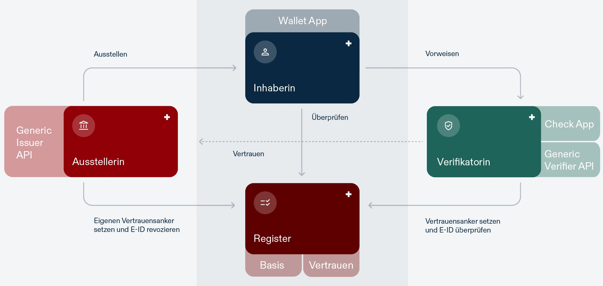

Following the successful milestone of the eLFA project, our next major step towards the Swiss e-ID and its trust infrastructure is the **Public Beta** phase. Public Beta will allow ecosystem participants to integrate and experiment with their business cases, including using a Beta ID credential.

The Public Beta environment is designed to test and refine the e-ID technology stack. Participants will be able to explore and experiment with various use cases.

## Open Source Repositories

The source code of the Swiss e-ID Trust Infrastructure is publicly available under the **MIT-License**. This allows the [Open Source community](https://github.com/swiyu-admin-ch/community) to integrate our components under permissive conditions. We welcome contributions and feedback in various forms. The options are described in the respective repositories and depend on the current development process:

- **Community Development**: Core libraries and shared components are developed openly with the community, with ongoing updates.

- **Internal Development**: Specific apps, registries, and components are developed privately and released publicly after each sprint. The published code can therefore only be a snapshot of the current development and not a thoroughly tested version.

The following components are available for Public Beta:

### swiyu Base Registry

Entities can onboard, update, or offboard as issuers and verifiers within the ecosystem. The base registry will manage the public keys as part of the DIDDOC required for ecosystem interactions. Status lists containing information related to credential validity can be managed.

The source code is divided in different services:

- [Base Registry Authoring Service](https://github.com/e-id-admin/eidch-registry-base-authoring)
- [Base Registry Data Service](https://github.com/e-id-admin/eidch-registry-base-data)
- [Status Registry Authoring Service](https://github.com/e-id-admin/eidch-registry-status-authoring)
- [Status Registry Data Service](https://github.com/e-id-admin/eidch-registry-status-data)
 

### swiyu Trust Registry

Entities can prove and maintain their status as verified issuers or verifiers, ensuring additional trust within the ecosystem. Users will be able to see the verification status of issuers and verifiers in their wallets and verifiers are able to validate the trust-status of the issuers.

The source code is divided in an authoring and a data service:

- [Authoring Service](https://github.com/e-id-admin/eidch-registry-trust-authoring)
- [Data Service](https://github.com/e-id-admin/eidch-registry-trust-data)

### swiyu Generic Issuer 
Entities can issue, revoke, suspend, and reactivate Verifiable Credentials (VCs), using the generic reference issuer implementation provided by the federal government. 

The source code is available as management and signing service:

- [Generic issuer management service](https://github.com/swiyu-admin-ch/eidch-issuer-agent-management)
- [Generic issuer signing service OID4VCI](https://github.com/swiyu-admin-ch/eidch-issuer-agent-oid4vci)

### swiyu Generic Verifier
Entities can integrate the reference verifier implementation to verify VCs, ensuring cryptographic integrity and validity according to their specific needs.

The source code is available as management and verification service:

- [Generic verifier management service](https://github.com/swiyu-admin-ch/eidch-verifier-agent-management)
- [Generic verification service OID4VP](https://github.com/swiyu-admin-ch/eidch-verifier-agent-oid4vp)

### Holder wallet

Users will be able to download the public beta wallet, request Beta-ID credentials for testing purpose, manage their VCs and interact with the ecosystem.

The source code is available for iOS and Android:

- [iOS Wallet App](https://github.com/e-id-admin/eidch-ios-wallet)
- [Android Wallet App](https://github.com/e-id-admin/eidch-android-wallet)

### DID Toolbox and DID Resolver

We developed different helpers to create and resolve DIDs. Creating DIDs involves a set of steps that are error prone or need some time to get familiar with and one might end up with invalid DIDs. The DID Toolbox supports you with various options for a quick start or advanced usage. 

- [DID Toolbox](https://github.com/e-id-admin/didtoolbox-java)
- [DID Resolver](https://github.com/e-id-admin/didresolver)

## How to use the Public Beta components

The onboarding process for the base- and trust-registry and other use cases are documented in the [Cookbook](https://swiyu-admin-ch.github.io/cookbooks/) section. Advanced users will find more technical details in the different repositories. We integrate various technologies in the Swiss Trust Infrastructure. You can view the supported specifications and the integrated versions in the ["Interoperability Profile"](https://swiyu-admin-ch.github.io/swiss-profile/).

